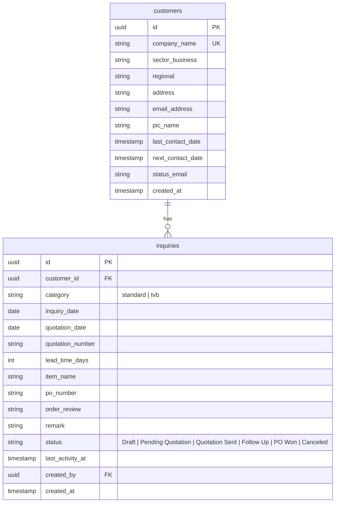

# Design Document: Inquiry Handling CRM

**Date**: 2026-05-26  
**Status**: APPROVED  
**Target Platform**: Next.js (React), Supabase, Vercel, GitHub  

---

## 📖 1. Executive Summary
This document defines the architecture and design of the **Inquiry Handling CRM**, a modern, high-performance web application designed to replace spreadsheet-based tracking of business inquiries and customer contacts. It introduces automated follow-up status tracking, visual indicators for stale entries, real-time dashboard analytics, and clean side-drawer details management.

---

## 🏗️ 2. Core Architecture
The CRM utilizes a serverless, decoupled architecture for speed and safety:

*   **Frontend**: Next.js App Router (React) deployed on Vercel. 
*   **Database & Auth**: Supabase (PostgreSQL + Realtime + WebSockets).
*   **Styling**: Custom modern Vanilla CSS utilizing CSS Custom Properties for theme support (Dark/Light).
*   **Deployment**: CI/CD connected via GitHub to Vercel (Push-to-Deploy).

---

## 🗄️ 3. Database Schema

The system utilizes a relational schema to merge all Excel quotation sheets (*New Quotation*, *TVB quotation*, *New Order (PO)*, and *Canceled Inquiry*) into a single unified record system.



### Table Structure SQL

```sql
-- Create Customers Table
CREATE TABLE public.customers (
    id UUID PRIMARY KEY DEFAULT gen_random_uuid(),
    company_name TEXT UNIQUE NOT NULL,
    sector_business TEXT,
    regional TEXT,
    address TEXT,
    email_address TEXT,
    pic_name TEXT,
    last_contact_date TIMESTAMP WITH TIME ZONE,
    next_contact_date TIMESTAMP WITH TIME ZONE,
    status_email TEXT,
    created_at TIMESTAMP WITH TIME ZONE DEFAULT timezone('utc'::text, now()) NOT NULL
);

-- Create Inquiries Table
CREATE TABLE public.inquiries (
    id UUID PRIMARY KEY DEFAULT gen_random_uuid(),
    customer_id UUID REFERENCES public.customers(id) ON DELETE CASCADE NOT NULL,
    category TEXT NOT NULL DEFAULT 'standard', -- 'standard' or 'tvb'
    inquiry_date DATE NOT NULL DEFAULT CURRENT_DATE,
    quotation_date DATE,
    quotation_number TEXT,
    lead_time_days INTEGER,
    item_name TEXT NOT NULL,
    po_number TEXT,
    order_review TEXT,
    remark TEXT,
    status TEXT NOT NULL DEFAULT 'Pending Quotation', -- 'Draft', 'Pending Quotation', 'Quotation Sent', 'Follow Up', 'PO Won', 'Canceled'
    last_activity_at TIMESTAMP WITH TIME ZONE DEFAULT timezone('utc'::text, now()) NOT NULL,
    created_at TIMESTAMP WITH TIME ZONE DEFAULT timezone('utc'::text, now()) NOT NULL
);

-- Enable Realtime for automatic dashboard updates
ALTER PUBLICATION supabase_realtime ADD TABLE public.customers;
ALTER PUBLICATION supabase_realtime ADD TABLE public.inquiries;
```

---

## 🎨 4. Frontend & User Interface

### Layout Design
A sleek, single-page application (SPA) layout utilizing high-end modern styling (glassmorphism, subtle animations, Outfit typography, HSL-tailored colors).

1.  **Sidebar/Navigation**:
    *   CRM Logo & App Title.
    *   Navigation tabs: `📊 Dashboard`, `📁 Inquiries Pipeline`, `👥 Customer Contact`.
    *   Bottom: Theme Switcher (Dark/Light) and User Profile.
2.  **KPI metrics row**:
    *   **Total Inquiries**: Total volume.
    *   **Pending Quotation** (Electric Blue): Inquiries missing a `quotation_number`.
    *   **Active Follow-Ups** (Amber): Inquiries in "Follow Up" state.
    *   **Stale Inquiries** (Red alert): Inquiries with `last_activity_at` older than 3 days.
    *   **Orders Won** (Emerald Green): Inquiries in "PO Won" state.
3.  **Active Workspace View**:
    *   **Dashboard view**: Mini analytics charts, recent inquiries, PIC workload counters, and a quick list of stale inquiries needing immediate follow-up.
    *   **Inquiries Pipeline view**: Fully searchable, filterable grid with status-colored tags. Contains a `+ Add Inquiry` button.
    *   **Customer Directory view**: Business sectors, emails, regional data, and contact logs.
4.  **Interactive Detail Drawer**:
    *   Slides out from the right when an inquiry row is clicked.
    *   Contains fully editable fields, allowing direct updates of `quotation_number` (once generated from your other system), adding follow-up comments to `remark`, updating statuses, or assigning PICs.

---

## 🚦 5. Stale Inquiry Detection Logic
To resolve the spreadsheets' poor follow-up indicators, the frontend and database will flag an inquiry as **Stale** if:
$$\text{Current Date} - \text{last\_activity\_at} > 3 \text{ days}$$
This is visually emphasized with pulsing red indicator dots and a dedicated "Stale Action List" on the dashboard.

---

## 🔒 6. Security (Supabase RLS)
Row Level Security (RLS) policies will be configured to ensure that:
1.  Read access is public/authenticated depending on your company preference.
2.  Insert, Update, and Delete are protected so only authorized team members can make alterations.

---

## 🛠️ 7. Environment Mapping & Setup
To ensure local dev and Vercel cloud remain fully synchronized without editing code, we support dual-environment mapping:
```javascript
const supabaseUrl = process.env.NEXT_PUBLIC_SUPABASE_URL || process.env.Supabase_url;
const supabaseKey = process.env.NEXT_PUBLIC_SUPABASE_ANON_KEY || process.env.Supabase_Key;
```
This maps Vercel's custom variables `Supabase_url` and `Supabase_Key` seamlessly.
